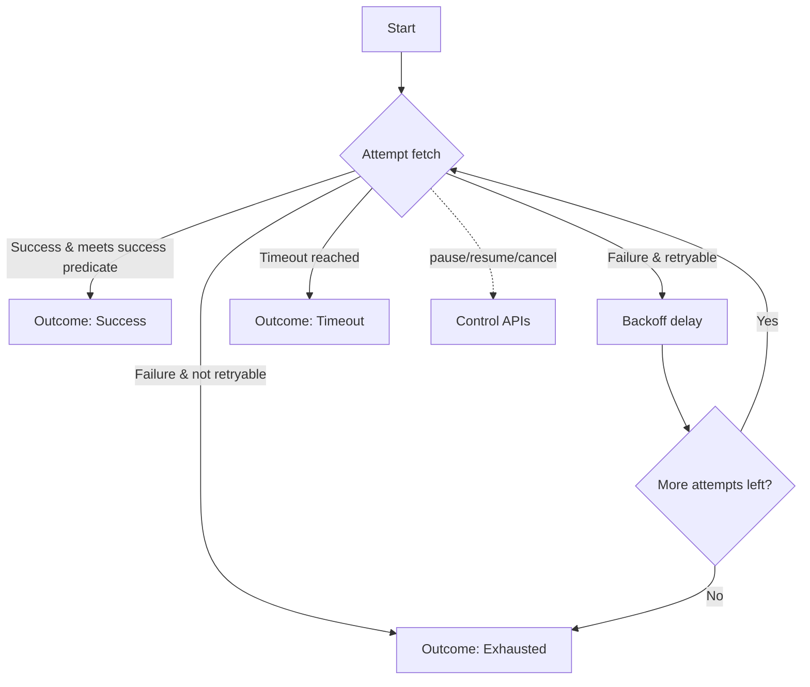

# PollingEngine

Last updated: 2025-09-08 17:36

[](https://central.sonatype.com/artifact/in.androidplay/pollingengine)

[](#license)
[](#setupbuild-instructions)

A Kotlin Multiplatform library for Android and iOS that provides a production‑ready polling engine
with:

- Exponential backoff and jitter
- Timeouts (overall and per‑attempt)
- Cancellation and control APIs
- Observability hooks (attempt/result/complete)

Mermaid flow diagram (GitHub renders this):



- Modules:
    - [/pollingengine](./pollingengine) — library code
    - [/composeApp](./composeApp/src) — sample shared UI (Compose Multiplatform)
    - [/iosApp](./iosApp/iosApp) — iOS app entry (SwiftUI)

## Project Overview

Note: Public API rename — PollingEngineApi has been renamed to PollingApi, and apps should use the
facade object `Polling` instead of referencing `PollingEngine` directly.

PollingEngine helps you repeatedly call a function until a condition is met or limits are reached.
It is designed for long‑polling workflows like waiting for a server job to complete, checking
payment status, etc.

Platforms: Kotlin Multiplatform (common code) with Android and iOS targets.

Highlights:

- Simple DSL with pollingConfig { … }
- Backoff presets (e.g., BackoffPolicies.quick20s)
- Control operations: pause(id), resume(id), cancel(id), cancelAll(), shutdown()
- Domain‑level results via PollingResult and terminal PollingOutcome

## Installation and Dependency

Coordinates on Maven Central:

- groupId: in.androidplay
- artifactId: pollingengine
- version: 0.1.1

Gradle Kotlin DSL (Android/shared):

```kotlin
repositories { mavenCentral() }
dependencies { implementation("in.androidplay:pollingengine:0.1.1") }
```

Gradle Groovy DSL:

```groovy
repositories { mavenCentral() }
dependencies { implementation "in.androidplay:pollingengine:0.1.1" }
```

Maven:

```xml

<dependency>
  <groupId>in.androidplay</groupId>
    <artifactId>pollingengine</artifactId>
  <version>0.1.1</version>
</dependency>
```

iOS integration options:

- CocoaPods (from this repository during development):

```ruby
# Podfile (example)
platform :ios, '14.0'
use_frameworks!

target 'YourApp' do
  pod 'pollingengine', :path => '../pollingengine'
end
```

Then:

```bash
./gradlew :pollingengine:generateDummyFramework
cd iosApp && pod install
```

- Swift Package Manager: If you publish an XCFramework, add the package URL and version in Xcode. (
  SPM publication is not configured in this repo out‑of‑the‑box.)

## Android Implementation

On Android, you'll typically use the polling engine within a ViewModel and expose the results to
your UI using StateFlow.

**ViewModel Example:**
```kotlin
class PollingViewModel : ViewModel() {

  private val _uiState = MutableStateFlow<PollingUiState>(PollingUiState.Idle)
  val uiState: StateFlow<PollingUiState> = _uiState.asStateFlow()

  private var pollingSession: PollingSession? = null

  fun startPolling() {
    viewModelScope.launch {
      _uiState.value = PollingUiState.Loading

      val pollingFlow = Polling.startPolling<String> {
        fetch = {
          // Your network call or other async operation
          // e.g., api.checkJobStatus()
          // Return PollingResult.Success, PollingResult.Failure, or PollingResult.Waiting
        }
        isTerminalSuccess = { it.equals("COMPLETED", ignoreCase = true) }
        backoff = BackoffPolicy(
          initialDelayMs = 1000,
          maxDelayMs = 10000,
          multiplier = 1.5,
          maxAttempts = 10
        )
        shouldRetryOnError = RetryPredicates.networkOrServerOrTimeout
      }

      // Get the session ID
      pollingSession = Polling.listActiveIds().firstOrNull()?.let { PollingSession(it) }

      pollingFlow.collect { outcome ->
        when (outcome) {
          is PollingOutcome.Success -> _uiState.value = PollingUiState.Success(outcome.value)
          is PollingOutcome.Exhausted -> _uiState.value =
            PollingUiState.Error("Polling exhausted after ${outcome.attempts} attempts.")
          is PollingOutcome.Timeout -> _uiState.value = PollingUiState.Error("Polling timed out.")
          is PollingOutcome.Cancelled -> _uiState.value = PollingUiState.Idle
        }
      }
    }
  }

  fun cancelPolling() {
    pollingSession?.let {
      viewModelScope.launch {
        Polling.cancel(it.id)
      }
    }
  }

  override fun onCleared() {
    super.onCleared()
    cancelPolling()
  }
}

sealed class PollingUiState {
  object Idle : PollingUiState()
  object Loading : PollingUiState()
  data class Success(val data: String) : PollingUiState()
  data class Error(val message: String) : PollingUiState()
}
```

**Lifecycle Management:**
It's crucial to cancel the polling operation when the ViewModel is cleared to avoid memory leaks.
The `onCleared()` method is the perfect place for this.

## iOS (Swift) Implementation

For iOS, you can use a helper class in your shared Kotlin module to expose the polling functionality
to Swift.

**Shared Kotlin Helper:**
```kotlin
// In your shared module (e.g., in a file named IosPollingHelper.kt)
object IosPollingHelper {
  fun startStatusPolling(
    onUpdate: (String) -> Unit,
    onComplete: (PollingOutcome<String>) -> Unit
  ): Job {
    val scope = CoroutineScope(Dispatchers.Main)
    return Polling.startPolling<String> {
      fetch = {
        // Your fetch logic here
      }
      isTerminalSuccess = { it.equals("COMPLETED", ignoreCase = true) }
      backoff = BackoffPolicies.quick20s
      onAttempt = { attempt, _ ->
        onUpdate("Polling attempt: $attempt")
      }
    }.onEach { outcome ->
      onComplete(outcome)
    }.launchIn(scope)
    }
}
```

**SwiftUI ViewModel:**

```swift
import SwiftUI
import pollingengine // Your KMP module name

@MainActor
class PollingViewModel: ObservableObject {
  @Published var status: String = "Idle"
  private var pollingJob: Kotlinx_coroutines_coreJob?

  func startPolling() {
    status = "Polling started..."
    pollingJob = IosPollingHelper.shared.startStatusPolling(
            onUpdate: { [weak self] updateMessage in
              self?.status = updateMessage
            },
            onComplete: { [weak self] outcome in
              if let success = outcome as? PollingOutcome.Success<NSString> {
                self?.status = "Success: \(success.value)"
              } else if let exhausted = outcome as? PollingOutcome.Exhausted {
                self?.status = "Polling exhausted after \(exhausted.attempts) attempts."
              } else if outcome is PollingOutcome.Timeout {
                self?.status = "Polling timed out."
              } else if outcome is PollingOutcome.Cancelled {
                self?.status = "Polling cancelled."
              }
            }
    )
  }

  func cancelPolling() {
    pollingJob?.cancel(cause: nil)
    status = "Idle"
    }
}
```

**SwiftUI View:**
```swift
struct ContentView: View {
  @StateObject private var viewModel = PollingViewModel()

  var body: some View {
    VStack {
      Text(viewModel.status)
          .padding()
      Button("Start Polling") {
        viewModel.startPolling()
      }
      Button("Cancel Polling") {
        viewModel.cancelPolling()
      }
    }
  }
}
```

## Setup/Build Instructions

Clone and build:

```bash
git clone https://github.com/bosankus/PollingEngine.git
cd PollingEngine
./gradlew build
```

Run tests (all targets where applicable):

```bash
./gradlew :pollingengine:allTests
```

Android app:

```bash
./gradlew :composeApp:installDebug
```

iOS builds (macOS):

- Open iosApp in Xcode and run on a simulator.
- If CoreSimulator issues arise, run `scripts/fix-ios-simulator.sh` then retry.

## Publishing & Versioning

Publishing to Maven Central uses com.vanniktech.maven.publish.

- Required environment variables/Gradle properties (typically set in CI):
    - OSSRH_USERNAME, OSSRH_PASSWORD
    - SIGNING_KEY (Base64 GPG private key), SIGNING_PASSWORD
  - GROUP: in.androidplay (already configured)
- Commands:

```bash
./gradlew :pollingengine:publishToMavenLocal
./gradlew :pollingengine:publish --no-configuration-cache
```

- See docs/ci-setup.md and docs/tasks.md for more details and suggested CI steps.

Versioning policy: Semantic Versioning (MAJOR.MINOR.PATCH). Public API stability is guarded by
Kotlin Binary Compatibility Validator.

Release notes: maintain CHANGELOG.md for each version. Tag releases on Git and reference them in
release notes.

## Contributing

We welcome contributions!

- Fork the repo and create a feature branch
- Follow Kotlin style and ktlint; run `./gradlew ktlintCheck detekt`
- Ensure tests pass: `./gradlew build`
- Open a Pull Request describing your changes

Guidelines and policies:

- [CONTRIBUTING.md](CONTRIBUTING.md)
- [CODE_OF_CONDUCT.md](CODE_OF_CONDUCT.md)
- Binary compatibility: explicit API mode and API checks are enabled; please run
  `./gradlew apiCheck` when modifying public APIs.

## License

Licensed under the Apache License, Version 2.0. See [LICENSE](LICENSE).

Copyright (c) 2025 AndroidPlay

## Maintainers & Support

- Maintainer: @bosankus
- Issues: use [GitHub Issues](https://github.com/bosankus/PollingEngine/issues)
- Security: see [SECURITY.md](SECURITY.md)
