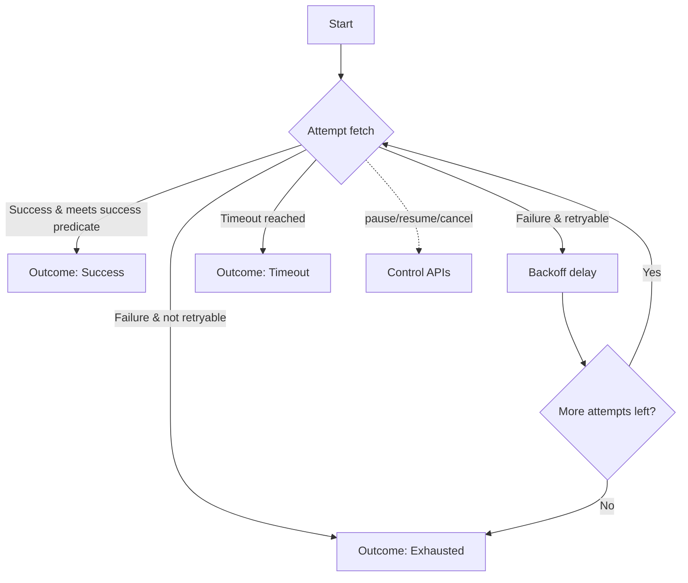

# PollingEngine

[](https://central.sonatype.com/artifact/io.github.bosankus/pollingengine)

[](#license)
[](#setupbuild-instructions)

A Kotlin Multiplatform library for Android and iOS that provides a production‑ready polling engine
with:

- Exponential backoff and jitter
- Timeouts (overall and per‑attempt)
- Cancellation and control APIs
- Observability hooks (attempt/result/complete)
- Pluggable logging and metrics

Mermaid flow diagram (GitHub renders this):



- Modules:
    - [/pollingengine](./pollingengine) — library code
    - [/composeApp](./composeApp/src) — sample shared UI (Compose Multiplatform)
    - [/iosApp](./iosApp/iosApp) — iOS app entry (SwiftUI)

## Project Overview

PollingEngine helps you repeatedly call a function until a condition is met or limits are reached.
It is designed for long‑polling workflows like waiting for a server job to complete, checking
payment status, etc.

Platforms: Kotlin Multiplatform (common code) with Android and iOS targets.

Highlights:

- Simple DSL with pollingConfig { … }
- Backoff presets (e.g., BackoffPolicies.quick20s)
- Control operations: pause(id), resume(id), cancel(handle/id), cancelAll(), shutdown()
- Domain‑level results via PollingResult and terminal PollingOutcome

## Installation and Dependency

Coordinates on Maven Central:

- groupId: io.github.bosankus
- artifactId: pollingengine
- version: 0.1.0

Gradle Kotlin DSL (Android/shared):

```kotlin
repositories { mavenCentral() }
dependencies { implementation("io.github.bosankus:pollingengine:0.1.0") }
```

Gradle Groovy DSL:

```groovy
repositories { mavenCentral() }
dependencies { implementation "io.github.bosankus:pollingengine:0.1.0" }
```

Maven:

```xml

<dependency>
    <groupId>io.github.bosankus</groupId>
    <artifactId>pollingengine</artifactId>
    <version>0.1.0</version>
</dependency>
```

iOS integration options:

- CocoaPods (from this repository during development):

```ruby
# Podfile (example)
platform :ios, '14.0'
use_frameworks!

target 'YourApp' do
  pod 'pollingengine', :path => '../pollingengine'
end
```

Then:

```bash
./gradlew :pollingengine:generateDummyFramework
cd iosApp && pod install
```

- Swift Package Manager: If you publish an XCFramework, add the package URL and version in Xcode. (
  SPM publication is not configured in this repo out‑of‑the‑box.)

## Usage

Basic shared usage:

```kotlin
import `in`.androidplay.pollingengine.models.PollingResult
import `in`.androidplay.pollingengine.polling.*

val config = pollingConfig<String> {
    fetch { /* return PollingResult<String> */ TODO() }
    success { it == "READY" }
    retry(DefaultRetryPredicates.retryOnNetworkServerTimeout)
    backoff(BackoffPolicies.quick20s)
}

suspend fun run(): PollingOutcome<String> = PollingEngine.pollUntil(config)
```

Android example (ViewModel + Compose):

```kotlin
class StatusViewModel : ViewModel() {
    private val _status = MutableStateFlow("Idle")
    val status: StateFlow<String> = _status

    private val config = pollingConfig<String> {
        fetch { TODO("Return PollingResult<String>") }
        success { it == "READY" }
        backoff(BackoffPolicies.quick20s)
    }

    fun runOnce() = viewModelScope.launch {
        _status.value = PollingEngine.pollUntil(config).toString()
    }
}
```

iOS example (Swift calling Kotlin helper):

```kotlin
// shared Kotlin
object IosAdapters {
    fun provideStatusConfig(): PollingConfig<String> = pollingConfig {
        fetch { TODO() }
        success { it == "READY" }
        backoff(BackoffPolicies.quick20s)
    }
}
```

```swift
// Swift

import PollingEngine

let handle = InAndroidplayPollingengineAdaptersIosAdapters().startStatusPolling { outcome in
    print("Outcome: \(outcome)")
}
```

API Reference:

- Generate locally with Dokka: `./gradlew :pollingengine:dokkaHtml`
- Output is in `pollingengine/build/dokka/html/index.html`

Platform‑specific notes:

- expect/actual: Core engine lives in commonMain. If you introduce platform APIs, add expect
  declarations in common and provide actual implementations in androidMain/iosMain.
- Coroutines: library uses kotlinx.coroutines; ensure proper dispatchers on each platform.

## Setup/Build Instructions

Clone and build:

```bash
git clone https://github.com/bosankus/PollingEngine.git
cd PollingEngine
./gradlew build
```

Run tests (all targets where applicable):

```bash
./gradlew :pollingengine:allTests
```

Android app:

```bash
./gradlew :composeApp:installDebug
```

iOS builds (macOS):

- Open iosApp in Xcode and run on a simulator.
- If CoreSimulator issues arise, run `scripts/fix-ios-simulator.sh` then retry.

## Publishing & Versioning

Publishing to Maven Central uses com.vanniktech.maven.publish.

- Required environment variables/Gradle properties (typically set in CI):
    - OSSRH_USERNAME, OSSRH_PASSWORD
    - SIGNING_KEY (Base64 GPG private key), SIGNING_PASSWORD
    - GROUP: io.github.bosankus (already configured)
- Commands:

```bash
./gradlew :pollingengine:publishToMavenLocal
./gradlew :pollingengine:publish --no-configuration-cache
```

- See docs/ci-setup.md and docs/tasks.md for more details and suggested CI steps.

Versioning policy: Semantic Versioning (MAJOR.MINOR.PATCH). Public API stability is guarded by
Kotlin Binary Compatibility Validator.

Release notes: maintain CHANGELOG.md for each version. Tag releases on Git and reference them in
release notes.

## Contributing

We welcome contributions!

- Fork the repo and create a feature branch
- Follow Kotlin style and ktlint; run `./gradlew ktlintCheck detekt`
- Ensure tests pass: `./gradlew build`
- Open a Pull Request describing your changes

Guidelines and policies:

- [CONTRIBUTING.md](CONTRIBUTING.md)
- [CODE_OF_CONDUCT.md](CODE_OF_CONDUCT.md)
- Binary compatibility: explicit API mode and API checks are enabled; please run
  `./gradlew apiCheck` when modifying public APIs.

## License

Licensed under the Apache License, Version 2.0. See [LICENSE](LICENSE).

Copyright (c) 2025 AndroidPlay

## Maintainers & Support

- Maintainer: @bosankus
- Issues: use [GitHub Issues](https://github.com/bosankus/PollingEngine/issues)
- Security: see [SECURITY.md](SECURITY.md)
