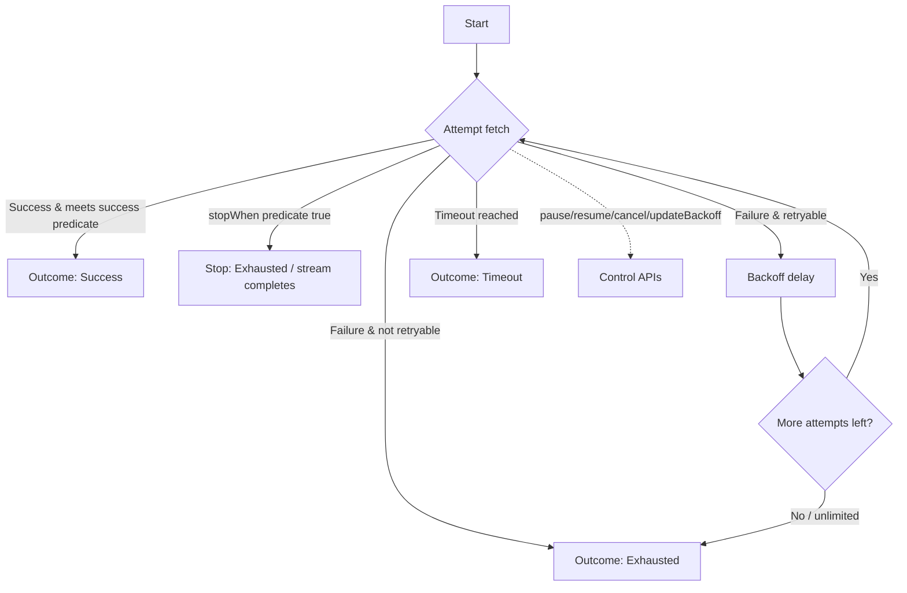

# PollingEngine

Last updated: 2026-06-19

[](https://central.sonatype.com/artifact/in.androidplay/pollingengine)

[](#license)
[](#setupbuild-instructions)

A Kotlin Multiplatform library for Android and iOS that provides a production‑ready polling engine
with:

- Exponential backoff and jitter, plus a fixed‑interval preset
- Timeouts (overall and per‑attempt) and bounded **or unbounded** runs
- Three execution models: **converge** (`startPolling`/`run`), **continuous stream** (`observe`),
  and
  **multiplexed shared sessions** (`shared`)
- Control APIs: pause, resume, cancel, cancel‑all, update backoff, shutdown
- Observability hooks (attempt/result/complete) and domain‑level results


```mermaid
flowchart TD
    A[Start] --> B{Attempt fetch}
    B -->|Success & meets success predicate| C[Outcome: Success]
    B -->|stopWhen predicate true| I[Stop: Exhausted / stream completes]
    B -->|Failure & retryable| D[Backoff delay]
    B -->|Failure & not retryable| E[Outcome: Exhausted]
    B -->|Timeout reached| F[Outcome: Timeout]
    D --> G{More attempts left?}
    G -->|Yes| B
    G -->|No / unlimited| E
    %% External control
    B -. pause/resume/cancel/updateBackoff .-> H[Control APIs]
```

Modules:

- [/pollingengine](./pollingengine) — library code
- [/composeApp](./composeApp/src) — sample shared UI (Compose Multiplatform)
- [/iosApp](./iosApp/iosApp) — iOS app entry (SwiftUI)

## Table of Contents

- [Project Overview](#project-overview)
- [What's New in 0.2.0](#whats-new-in-020)
- [Core Concepts](#core-concepts)
- [Public API Reference](#public-api-reference)
- [Installation and Dependency](#installation-and-dependency)
- [Android Implementation](#android-implementation)
- [iOS (Swift) Implementation](#ios-swift-implementation)
- [Backoff & Retry Reference](#backoff--retry-reference)
- [Setup/Build Instructions](#setupbuild-instructions)
- [Publishing & Versioning](#publishing--versioning)
- [Contributing](#contributing)
- [License](#license)

## Project Overview

PollingEngine helps you repeatedly call a function until a condition is met or limits are reached,
or
to continuously observe a remote value over time. It is designed for long‑polling workflows like
waiting for a server job to complete, checking payment/compliance status, or streaming a live list.

Platforms: Kotlin Multiplatform (common code) with Android and iOS targets.

> **API entry point:** use the facade object `Polling` (which implements the `PollingApi`
> interface).
> Do not reference `PollingEngine` directly — it is internal.

## What's New in 0.2.0

All additions are backward compatible — existing `startPolling`/`run`/`compose`, `PollingConfig`,
`BackoffPolicy`, and `PollingOutcome` behavior is unchanged.

| Feature                         | API                                                                             | Summary                                                                                                                         |
|---------------------------------|---------------------------------------------------------------------------------|---------------------------------------------------------------------------------------------------------------------------------|
| **Unbounded polling**           | `maxAttempts = 0` (`UNLIMITED_ATTEMPTS`), `overallTimeoutMs = 0` (`NO_TIMEOUT`) | `0` now means "no limit"; check via `isAttemptsUnlimited` / `isOverallTimeoutDisabled`. Defaults unchanged (8 attempts / 120s). |
| **Fixed‑interval preset**       | `BackoffPolicies.fixed(intervalMs, …)`                                          | Constant cadence, no growth, no jitter; unbounded by default.                                                                   |
| **Continuous streaming**        | `Polling.observe { } : Flow<T>`                                                 | Emits every successful tick value instead of converging to one outcome.                                                         |
| **Stop predicate**              | `stopWhen = { … }`                                                              | Ends polling on a non‑success terminal (e.g. empty list).                                                                       |
| **Multiplexed sessions**        | `Polling.shared(key) { } : SharedPollingSession<T>`                             | One poll loop per key (one `fetch()` per tick) fanned out to many subscribers via `stream()` / `stream(filter)`.                |
| **Subscriber‑driven lifecycle** | builder `stopTimeoutMs`, `replay`                                               | Start on first subscriber; keep alive a grace period after the last leaves; replay recent values to late subscribers.           |

> Note: `Polling.shared` is a `suspend` function (registry access is mutex‑guarded for multiplatform
> thread‑safety).

## Core Concepts

**`PollingResult<T>`** — what your `fetch` returns each tick:

| Variant                                             | Meaning                                                                  |
|-----------------------------------------------------|--------------------------------------------------------------------------|
| `PollingResult.Success(data)`                       | A value was retrieved; checked against `isTerminalSuccess` / `stopWhen`. |
| `PollingResult.Failure(error)`                      | Failed this tick; retried if `shouldRetryOnError(error)` is true.        |
| `PollingResult.Waiting`                             | Not ready yet; keep polling.                                             |
| `PollingResult.Cancelled` / `PollingResult.Unknown` | Cancelled / indeterminate state.                                         |

**`PollingOutcome<T>`** — the terminal result of a *converge* run (`startPolling`/`run`/`compose`):

| Variant                    | Fields                                                            |
|----------------------------|-------------------------------------------------------------------|
| `PollingOutcome.Success`   | `value`, `attempts`, `elapsedMs`                                  |
| `PollingOutcome.Exhausted` | `last`, `attempts`, `elapsedMs` (also used when `stopWhen` fires) |
| `PollingOutcome.Timeout`   | `last`, `attempts`, `elapsedMs`                                   |
| `PollingOutcome.Cancelled` | `attempts`, `elapsedMs`                                           |

**Execution models:**

- **Converge** — `Polling.startPolling { } : Flow<PollingOutcome<T>>` (or `Polling.run { }`
  suspending)
  polls until terminal success, exhaustion, timeout, or cancellation, then emits one
  `PollingOutcome`.
- **Observe** — `Polling.observe { } : Flow<T>` emits the value of *every* successful tick and keeps
  running until a stop condition (terminal success, `stopWhen`, non‑retryable failure, or limits).
- **Shared** — `Polling.shared(key) { } : SharedPollingSession<T>` runs one loop per key and fans
  each
  tick value out to all `stream()` subscribers with a single `fetch()` per tick.

## Public API Reference

The `Polling` facade (`PollingApi`):

| Member             | Signature                                               | Notes                                       |
|--------------------|---------------------------------------------------------|---------------------------------------------|
| `startPolling`     | `(config) / { builder } -> Flow<PollingOutcome<T>>`     | Converge mode.                              |
| `observe`          | `{ builder } -> Flow<T>`                                | Continuous stream of success values.        |
| `shared`           | `suspend (key, { builder }) -> SharedPollingSession<T>` | Multiplexed session per key.                |
| `run`              | `suspend (config) -> PollingOutcome<T>`                 | One‑shot converge, suspending.              |
| `compose`          | `suspend (vararg configs) -> PollingOutcome<T>`         | Run configs sequentially.                   |
| `pause` / `resume` | `suspend (id)`                                          | Pause/resume a running session by id.       |
| `cancel`           | `suspend (id) / (session)`                              | Cancel a session.                           |
| `cancelAll`        | `suspend ()`                                            | Cancel every active session.                |
| `updateBackoff`    | `suspend (id, newPolicy)`                               | Hot‑swap backoff on a running session.      |
| `shutdown`         | `suspend ()`                                            | Stop the engine; no new sessions afterward. |
| `activePollsCount` | `() -> Int`                                             | Number of active sessions.                  |
| `listActiveIds`    | `suspend () -> List<String>`                            | IDs of active sessions.                     |

`SharedPollingSession<T>`: `val key`, `fun stream(): Flow<T>`,
`fun stream(filter: (T) -> Boolean): Flow<T>`.

`PollingConfigBuilder<T>` fields: `fetch` (required), `isTerminalSuccess` (required for converge),
`shouldRetryOnError`, `backoff`, `dispatcher`, `onAttempt`, `onResult`, `onComplete`,
`throwableMapper`, `stopWhen`, and streaming‑only `stopTimeoutMs`, `replay`.

## Installation and Dependency

Coordinates on Maven Central:

- groupId: `in.androidplay`
- artifactId: `pollingengine`
- version: `0.2.0`

Gradle Kotlin DSL (Android/shared):

```kotlin
repositories { mavenCentral() }
dependencies { implementation("in.androidplay:pollingengine:0.2.0") }
```

Gradle Groovy DSL:

```groovy
repositories { mavenCentral() }
dependencies { implementation "in.androidplay:pollingengine:0.2.0" }
```

Maven:

```xml
<dependency>
  <groupId>in.androidplay</groupId>
  <artifactId>pollingengine</artifactId>
  <version>0.2.0</version>
</dependency>
```

### iOS integration

The iOS framework is published with baseName **`PollingEngine`** (import `PollingEngine` in Swift).

- CocoaPods (from this repository during development):

```ruby
# Podfile (example)
platform :ios, '14.0'
use_frameworks!

target 'YourApp' do
  pod 'pollingengine', :path => '../pollingengine'
end
```

Then:

```bash
./gradlew :pollingengine:generateDummyFramework
cd iosApp && pod install
```

- Swift Package Manager: If you publish an XCFramework, add the package URL and version in Xcode.
  (SPM publication is not configured in this repo out‑of‑the‑box.)

## Android Implementation

On Android you typically drive polling from a `ViewModel` and expose state via `StateFlow`. Three
patterns cover most needs.

### 1. Converge: poll until a job completes

`startPolling` returns a `Flow<PollingOutcome<T>>`. Collect it in a `Job` you can cancel; this is
the
simplest way to control a one‑off poll.

```kotlin
import `in`.androidplay.pollingengine.models.PollingResult
import `in`.androidplay.pollingengine.polling.*

class JobStatusViewModel(
    private val api: JobApi,
    private val jobId: String,
) : ViewModel() {

    private val _uiState = MutableStateFlow<JobUiState>(JobUiState.Idle)
    val uiState: StateFlow<JobUiState> = _uiState.asStateFlow()

    private var pollingJob: Job? = null

    fun startPolling() {
        if (pollingJob != null) return
        _uiState.value = JobUiState.Loading

        pollingJob = viewModelScope.launch {
            Polling.startPolling<String> {
                fetch = {
                    // Map your network call into a PollingResult
                    runCatching { api.checkStatus(jobId) }
                        .map { PollingResult.Success(it) }
                        .getOrElse { PollingResult.Failure(Error(-1, it.message)) }
                }
                isTerminalSuccess = { it.equals("COMPLETED", ignoreCase = true) }
                shouldRetryOnError = RetryPredicates.networkOrServerOrTimeout
                throwableMapper = ThrowableMappers.networkDefault
                backoff = BackoffPolicy(
                    initialDelayMs = 1_000,
                    maxDelayMs = 10_000,
                    multiplier = 1.5,
                    maxAttempts = 10,
                    overallTimeoutMs = 120_000,
                )
                onAttempt = { attempt, delayMs -> Log.d("Poll", "attempt #$attempt, next in $delayMs ms") }
            }.collect { outcome ->
                _uiState.value = when (outcome) {
                    is PollingOutcome.Success   -> JobUiState.Success(outcome.value)
                    is PollingOutcome.Exhausted -> JobUiState.Error("Exhausted after ${outcome.attempts} attempts")
                    is PollingOutcome.Timeout   -> JobUiState.Error("Timed out after ${outcome.elapsedMs} ms")
                    is PollingOutcome.Cancelled -> JobUiState.Idle
                }
            }
            pollingJob = null
        }
    }

    fun cancelPolling() {
        pollingJob?.cancel()
        pollingJob = null
    }

    override fun onCleared() {
        super.onCleared()
        cancelPolling()
    }
}

sealed interface JobUiState {
    data object Idle : JobUiState
    data object Loading : JobUiState
    data class Success(val data: String) : JobUiState
    data class Error(val message: String) : JobUiState
}
```

For a single suspending call without a Flow, use `Polling.run(config)` which returns the
`PollingOutcome` directly.

### 2. Observe: a continuous live stream

`observe` emits every successful tick and auto‑completes when `stopWhen` (or a terminal/limit)
fires.
Pair it with `BackoffPolicies.fixed` for a steady cadence.

```kotlin
val running = viewModelScope.launch {
    Polling.observe<Int> {
        fetch = { PollingResult.Success(api.currentQueuePosition()) }
        backoff = BackoffPolicies.fixed(intervalMs = 2_000) // one tick / 2s, forever
        stopWhen = { it is PollingResult.Success && it.data == 0 } // stop when we reach the front
    }.collect { position ->
        _uiState.update { it.copy(queuePosition = position) }
    }
}
// running.cancel() to stop early
```

### 3. Shared: one network call, many subscribers

`shared` de‑duplicates by `key`: a single `fetch()` per tick is fanned out to every `stream()`
collector. Polling starts on the first subscriber and stops `stopTimeoutMs` after the last leaves.

```kotlin
val session = Polling.shared<List<Service>>(key = vin) {
    fetch = { repository.getServicesList(vin).toPollingResult() }
    backoff = BackoffPolicies.fixed(intervalMs = 10_000)            // one tick / 10s, forever
    stopWhen = { it is PollingResult.Success && it.data.isEmpty() } // stop when the list drains
    stopTimeoutMs = 15_000                                          // keep alive 15s after last leaves
    replay = 1                                                      // late subscribers get the last value
}

// Two independent views fed by the SAME 10s network call:
viewModelScope.launch {
    session.stream { services -> services.any { it.isActive } }
        .collect { active -> _activeState.value = active }
}
viewModelScope.launch {
    session.stream { services -> services.any { it.needsAssociation } }
        .collect { assoc -> _assocState.value = assoc }
}
```

### Control APIs

`startPolling`/`observe` flows are controlled by cancelling their collecting `Job`. To control a
session by id (pause/resume/updateBackoff), look it up via `listActiveIds()`:

```kotlin
viewModelScope.launch {
    val id = Polling.listActiveIds().firstOrNull() ?: return@launch
    Polling.pause(id)
    Polling.resume(id)
    Polling.updateBackoff(id, BackoffPolicies.fixed(intervalMs = 5_000))
    Polling.cancel(id)
}
// Polling.cancelAll() / Polling.shutdown() for global control
```

> **Lifecycle:** always cancel polling when the `ViewModel` is cleared (`onCleared()`), or rely on
> `viewModelScope` cancellation, to avoid leaks.

## iOS (Swift) Implementation

Expose Kotlin Flows to Swift through a thin helper in your shared module, then bind to SwiftUI.
Import the framework as **`PollingEngine`**.

### Shared Kotlin helper

```kotlin
// shared module, e.g. IosPollingHelper.kt
import `in`.androidplay.pollingengine.models.PollingResult
import `in`.androidplay.pollingengine.polling.*
import kotlinx.coroutines.*
import kotlinx.coroutines.flow.launchIn
import kotlinx.coroutines.flow.onEach

object IosPollingHelper {

    private val scope = CoroutineScope(Dispatchers.Main)

    /** Converge: drives a job to completion and reports a single outcome. */
    fun startStatusPolling(
        fetch: suspend () -> String,
        onUpdate: (Int) -> Unit,
        onComplete: (PollingOutcome<String>) -> Unit,
    ): Job = Polling.startPolling<String> {
        this.fetch = { PollingResult.Success(fetch()) }
        isTerminalSuccess = { it.equals("COMPLETED", ignoreCase = true) }
        backoff = BackoffPolicies.quick20s
        shouldRetryOnError = RetryPredicates.networkOrServerOrTimeout
        onAttempt = { attempt, _ -> onUpdate(attempt) }
    }.onEach { onComplete(it) }.launchIn(scope)

    /** Observe: a continuous stream of every successful value. */
    fun observeQueue(
        fetch: suspend () -> Int,
        onValue: (Int) -> Unit,
    ): Job = Polling.observe<Int> {
        this.fetch = { PollingResult.Success(fetch()) }
        backoff = BackoffPolicies.fixed(intervalMs = 2_000)
        stopWhen = { it is PollingResult.Success && it.data == 0 }
    }.onEach { onValue(it) }.launchIn(scope)
}
```

### SwiftUI ViewModel

```swift
import SwiftUI
import PollingEngine // KMP framework baseName

@MainActor
final class PollingViewModel: ObservableObject {
    @Published var status: String = "Idle"
    private var job: Kotlinx_coroutines_coreJob?

    func start() {
        status = "Polling…"
        job = IosPollingHelper.shared.startStatusPolling(
            fetch: { try await MyApi.shared.checkStatus() },
            onUpdate: { [weak self] attempt in self?.status = "Attempt \(attempt)" },
            onComplete: { [weak self] outcome in
                switch outcome {
                case let success as PollingOutcome.Success<NSString>:
                    self?.status = "Success: \(success.value)"
                case let exhausted as PollingOutcome.Exhausted:
                    self?.status = "Exhausted after \(exhausted.attempts) attempts"
                case is PollingOutcome.Timeout:
                    self?.status = "Timed out"
                case is PollingOutcome.Cancelled:
                    self?.status = "Cancelled"
                default:
                    break
                }
            }
        )
    }

    func cancel() {
        job?.cancel(cause: nil)
        job = nil
        status = "Idle"
    }
}
```

### SwiftUI View

```swift
struct ContentView: View {
    @StateObject private var viewModel = PollingViewModel()

    var body: some View {
        VStack(spacing: 16) {
            Text(viewModel.status)
            Button("Start Polling") { viewModel.start() }
            Button("Cancel") { viewModel.cancel() }
        }
        .padding()
    }
}
```

> **Tip:** `Polling.shared` and other `suspend` members are exposed to Swift as completion‑handler /
> `async` functions. Wrap them in helper functions in the shared module (as above) to keep call
> sites
> clean, and collect Flows there rather than in Swift.

## Backoff & Retry Reference

**`BackoffPolicy`** (defaults shown):

```kotlin
BackoffPolicy(
    initialDelayMs = 500,
    maxDelayMs = 30_000,
    multiplier = 2.0,
    jitterRatio = 0.2,        // [0.0, 1.0]; 0 disables jitter
    maxAttempts = 8,          // 0 = UNLIMITED_ATTEMPTS
    overallTimeoutMs = 120_000, // 0 = NO_TIMEOUT
    perAttemptTimeoutMs = null, // null disables; must be > 0 when set
)
```

Validation rejects negative values, `maxDelayMs < initialDelayMs`, and `multiplier < 1.0`.

**Presets** (`BackoffPolicies`):

- `quick20s` — fast, ~20s overall budget, 20 attempts, 10s per‑attempt timeout.
- `fixed(intervalMs, perAttemptTimeoutMs?, maxAttempts?, overallTimeoutMs?)` — constant cadence,
  unbounded by default; the natural fit for `observe` / `shared`.

**Retry predicates** (`RetryPredicates`), passed to `shouldRetryOnError`:

- `networkOrServerOrTimeout` — retry network/server/timeout/unknown errors (recommended default).
- `always` / `never`.

**Throwable mappers** (`ThrowableMappers`), passed to `throwableMapper`, translate exceptions into a
domain `Error` for the retry predicate:

- `networkDefault` — timeouts → timeout code, else network code.
- `iosDefault` — alias of `networkDefault`.
- `kotlinxSerializationDefault` — serialization failures → server (bad payload), else unknown.

## Setup/Build Instructions

Clone and build:

```bash
git clone https://github.com/bosankus/PollingEngine.git
cd PollingEngine
./gradlew build
```

Run tests (all targets where applicable):

```bash
./gradlew :pollingengine:allTests
```

Android app:

```bash
./gradlew :composeApp:installDebug
```

iOS builds (macOS):

- Open `iosApp` in Xcode and run on a simulator.
- If CoreSimulator issues arise, run `scripts/fix-ios-simulator.sh` then retry.

## Publishing & Versioning

Publishing to Maven Central uses `com.vanniktech.maven.publish`.

- Required environment variables/Gradle properties (typically set in CI):
    - `OSSRH_USERNAME`, `OSSRH_PASSWORD`
    - `SIGNING_KEY` (Base64 GPG private key), `SIGNING_PASSWORD`
    - `GROUP`: `in.androidplay` (already configured)
- Commands:

```bash
./gradlew :pollingengine:publishToMavenLocal
./gradlew :pollingengine:publish --no-configuration-cache
```

Versioning policy: Semantic Versioning (MAJOR.MINOR.PATCH). Public API stability is guarded by
Kotlin Binary Compatibility Validator; run `./gradlew apiCheck` when modifying public APIs.

Release notes: maintain [CHANGELOG.md](CHANGELOG.md) for each version. Tag releases on Git and
reference them in release notes.

## Contributing

We welcome contributions!

- Fork the repo and create a feature branch
- Follow Kotlin style and ktlint; run `./gradlew ktlintCheck detekt`
- Ensure tests pass: `./gradlew build`
- Open a Pull Request describing your changes

Guidelines and policies:

- [CONTRIBUTING.md](CONTRIBUTING.md)
- [CODE_OF_CONDUCT.md](CODE_OF_CONDUCT.md)
- Binary compatibility: explicit API mode and API checks are enabled; please run
  `./gradlew apiCheck`
  when modifying public APIs.

## License

Licensed under the Apache License, Version 2.0. See [LICENSE](LICENSE).

Copyright (c) 2025 AndroidPlay

## Maintainers & Support

- Maintainer: @bosankus
- Issues: use [GitHub Issues](https://github.com/bosankus/PollingEngine/issues)
- Security: see [SECURITY.md](SECURITY.md)
  </content>
  </invoke>
