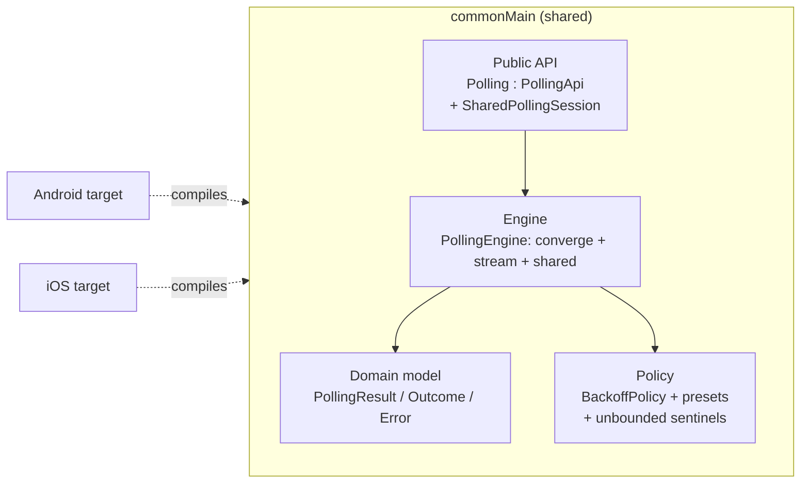
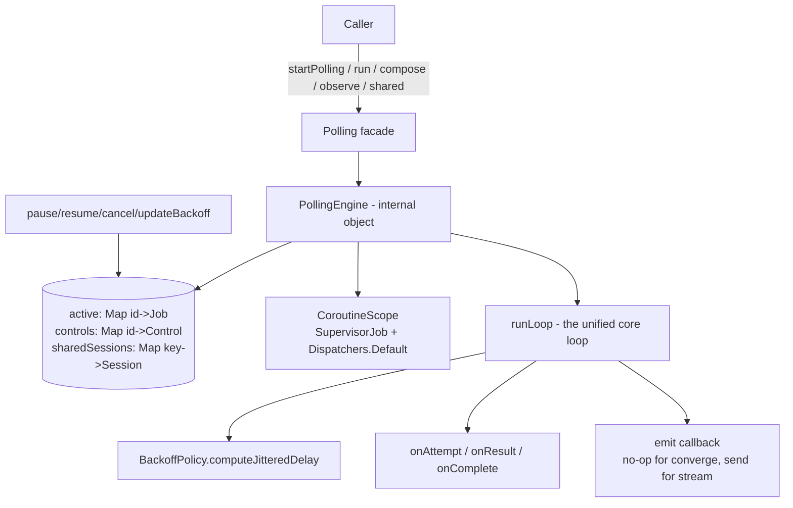

# Designing a Production-Grade Polling Engine in Kotlin Multiplatform — A System Design Walkthrough

> A staff-level deep dive into the design of the `:pollingengine` module: how to think about it, the
> decisions behind it, the trade-offs, and the failure modes you should be able to defend in an
> interview.

---

## 0. How to read this document

Most "system design" content is about distributed systems — load balancers, sharded databases,
message queues. But a large fraction of staff-engineer work is **library and SDK design**: defining
contracts that hundreds of other engineers build on, getting concurrency right, and making
correctness *the default* rather than something callers have to remember.

`PollingEngine` is exactly that kind of system: an **in-process, multiplatform SDK** whose job is to
repeatedly call a function until a condition is met or a limit is hit — reliably, cancellably, and
without hammering the backend.

This document walks through the design the way you'd want to present it in an interview:

1. Clarify the problem and pin down requirements.
2. Establish constraints and non-goals.
3. Design the public contract (API) before the internals.
4. Design the domain model.
5. Design the runtime: the engine loop, concurrency, and lifecycle.
6. Reason about the hard parts: backoff math, timeouts, cancellation.
7. Discuss observability, testing, trade-offs, and failure modes.
8. Close with how to *frame* this in an interview.

The recurring staff-level theme: **a polling engine is a small surface area hiding a large amount of
concurrency and timing correctness.** The interesting part is never "call the API in a loop" — it's
everything that goes wrong around that loop.

---

## 1. Problem statement & requirements

### 1.1 The problem in one sentence

> Repeatedly invoke a user-supplied asynchronous operation until it produces a *terminal* result, an
> error we shouldn't retry, or we exhaust our time/attempt budget — and do this safely across
> Android
> and iOS from a single shared codebase.

Concrete motivating use cases:

- Wait for a server-side job to finish (video transcode, report generation).
- Poll a payment/compliance status endpoint until it settles.
- Wait for an eventually-consistent resource to appear.

These all share a shape: **client-driven long-polling**, where the client controls cadence and the
server has no push channel.

A second family of use cases is **continuous observation** rather than converge-then-stop: keep an
always-on, fixed-interval view of a remote resource (e.g. a live list), emit every successful tick,
fan one fetch out to several independent UI consumers, and stop only when the resource drains or all
consumers leave. The engine serves both families from one core loop (§5.4, §6.7–6.8).

### 1.2 Functional requirements

| #   | Requirement                                                                                                                                                                                                                                                     |
|-----|-----------------------------------------------------------------------------------------------------------------------------------------------------------------------------------------------------------------------------------------------------------------|
| F1  | Execute a `suspend` fetch operation repeatedly until a caller-defined success condition holds.                                                                                                                                                                  |
| F2  | Distinguish *terminal* success from *non-terminal* success (a `200 OK` that says "still processing").                                                                                                                                                           |
| F3  | Decide per-error whether to retry (network blip → retry; `400 Bad Request` → stop).                                                                                                                                                                             |
| F4  | Apply **exponential backoff with jitter** between attempts.                                                                                                                                                                                                     |
| F5  | Enforce two independent budgets: an **overall timeout** and an optional **per-attempt timeout**.                                                                                                                                                                |
| F6  | Support runtime control: **pause, resume, cancel** an in-flight session, and **cancel-all / shutdown** globally.                                                                                                                                                |
| F7  | Allow the backoff policy to be **updated dynamically** on a running session.                                                                                                                                                                                    |
| F8  | Emit **observability** signals at attempt / result / completion boundaries.                                                                                                                                                                                     |
| F9  | Return a single, well-typed **terminal outcome** describing how the poll ended.                                                                                                                                                                                 |
| F10 | Support **composition**: run several polling stages in sequence, short-circuiting on the first failure.                                                                                                                                                         |
| F11 | Support **unbounded** polling — express "no attempt limit" and "no overall timeout" without hacks, for always-on observers.                                                                                                                                     |
| F12 | Provide **fixed-interval** (constant-cadence) scheduling as a first-class, named option.                                                                                                                                                                        |
| F13 | Support a **continuous streaming** mode that emits *every* successful tick's value (not just one terminal outcome) and runs until a stop condition fires.                                                                                                       |
| F14 | Support a **non-success terminal predicate** (`stopWhen`) that ends polling without a `Success` (e.g. "stop when the remote list drains"), distinct from terminal success.                                                                                      |
| F15 | Support **multiplexed / shared sessions**: one poll loop per key fans a single fetch-per-tick out to many subscribers, each with its own filter, with a **subscriber-driven** lifecycle (start on first subscriber, stop a grace period after the last leaves). |

### 1.3 Non-functional requirements

- **Correctness under cancellation.** Coroutine cancellation must never be swallowed; cancelled work
  must stop promptly and report a coherent outcome.
- **No thundering herd.** Many clients polling the same backend after an outage must not synchronize
  their retries.
- **Multiplatform.** One implementation in `commonMain`, no platform forks of the core logic.
- **Zero mandatory third-party dependencies.** Only the Kotlin stdlib and `kotlinx.coroutines`.
  Logging/serialization/HTTP are the *caller's* concern.
- **Negligible idle overhead.** The loop should cost effectively nothing per iteration beyond the
  user's own fetch.
- **Stable, minimal public API.** Internals must be free to change; the surface area exposed to
  consumers must be small and hard to misuse.
- **Deterministically testable.** Timing and randomness must be injectable so tests are fast and
  reproducible.

### 1.4 Non-goals (say these out loud in an interview)

- **Not** a background job scheduler or OS-level service (no `WorkManager`/`BGTaskScheduler`
  semantics; it does not survive process death).
- **Not** a transport layer. It does not know about HTTP, sockets, or serialization.
- **Not** a server-push / websocket alternative. It is *client-pull* polling by design.
- **Not** a distributed/cross-device coordinator. Each instance is in-process.

Stating non-goals is a staff-level signal: you're scoping the system and resisting the urge to boil
the ocean.

---

## 2. Constraints that shape every decision

Three constraints dominate the design:

1. **Kotlin Multiplatform (KMP).** The core must live in `commonMain`. That forbids JVM-only
   primitives (`Thread`, `ScheduledExecutorService`, `java.util.Timer`) and pushes us toward *
   *coroutines** as the single concurrency model that compiles to both the JVM (Android) and
   native (iOS).

2. **Coroutines as the concurrency substrate.** This is a gift and a constraint. We get structured
   concurrency, cooperative cancellation, and `suspend` functions for free — but we must respect
   their rules precisely (especially around `CancellationException`).

3. **Library, not application.** We don't own the process. We can't assume a `main()`, an Android
   `Application`, or an iOS app delegate. State we keep is *process-global* and must be defensively
   managed.



---

## 3. The public contract — designing the API first

A staff engineer designs the **boundary** before the implementation. The boundary is what you can
never take back.

### 3.1 The facade + interface pattern

```kotlin
public interface PollingApi {
    public fun activePollsCount(): Int
    public suspend fun listActiveIds(): List<String>

    public suspend fun cancel(id: String)
    public suspend fun cancel(session: PollingSession)
    public suspend fun cancelAll()
    public suspend fun shutdown()

    public suspend fun pause(id: String)
    public suspend fun resume(id: String)
    public suspend fun updateBackoff(id: String, newPolicy: BackoffPolicy)

    public fun <T> startPolling(config: PollingConfig<T>): Flow<PollingOutcome<T>>
    public fun <T> startPolling(builder: PollingConfigBuilder<T>.() -> Unit): Flow<PollingOutcome<T>>

    public fun <T> observe(builder: PollingConfigBuilder<T>.() -> Unit): Flow<T>
    public suspend fun <T> shared(
        key: Any,
        builder: PollingConfigBuilder<T>.() -> Unit
    ): SharedPollingSession<T>

    public suspend fun <T> run(config: PollingConfig<T>): PollingOutcome<T>
    public suspend fun <T> compose(vararg configs: PollingConfig<T>): PollingOutcome<T>
}

public object Polling : PollingApi { /* delegates to internal PollingEngine */ }
```

Two deliberate choices here:

- **`PollingApi` is an interface; `Polling` is the singleton facade; `PollingEngine` is `internal`.
  ** Consumers depend on the interface (mockable, stable). The engine — with all its mutable state
  and coroutine machinery — is hidden behind `internal` visibility and `explicitApi()` enforcement
  at compile time. This is the classic *façade + dependency-inversion* combination: the public type
  you depend on is small and the volatile implementation can't leak.

- **Five execution modes for five shapes of need.** The first three *converge* to a single
  `PollingOutcome`; the last two are *continuous* and emit a stream of values:
    - `startPolling(...) : Flow<PollingOutcome<T>>` — a *managed* converge session, registered for
      control (pause/resume/cancel by id), cancellation wired through `Flow` collection lifecycle.
      Emits exactly one terminal outcome.
    - `run(config) : PollingOutcome<T>` — a *fire-and-await* one-shot that runs in the caller's own
      coroutine. Simpler, but **not externally controllable** (it never registers an id — an
      explicit trade-off, see §6.4).
    - `compose(vararg configs)` — sequential pipelines that short-circuit.
    - `observe(...) : Flow<T>` — a **continuous stream** that emits the value of *every* successful
      tick (not a terminal outcome) and never auto-completes until a stop condition fires (terminal
      success, `stopWhen`, a non-retryable failure, or attempt/overall limits). Pair it with an
      unbounded policy for an always-on observer (see §6.7).
    - `shared(key, ...) : SharedPollingSession<T>` — a **multiplexed** session keyed by `key`: one
      poll loop, one `fetch()` per tick, fanned out to many subscribers, each with its own filter,
      with a subscriber-driven `WhileSubscribed` lifecycle (see §6.8).

The split is the important contract decision: a **converge** API answers "what was the final
result?", while a **continuous** API answers "feed me every value as it arrives." Trying to serve
both from one entry point would force one of the two callers to fight the type signature.

### 3.2 Why return a `Flow` for a single terminal value?

This surprises people: `startPolling` produces a `Flow<PollingOutcome<T>>` that emits **exactly one
** element (the terminal outcome) and then completes. Why a `Flow` and not a `suspend fun`?

Because the `Flow` gives us a **cancellation handle for free**. The implementation uses
`channelFlow { ... awaitClose { job.cancel() } }`: when the collector's scope is cancelled (e.g., a
`viewModelScope` tears down on screen exit), `awaitClose` fires and cancels the underlying polling
job. The collector never has to remember to clean up — *structured concurrency does it.*
Intermediate progress is surfaced through the observability hooks (§7), not through `Flow`
emissions, which keeps the stream's type honest: it carries the *result*, not the *journey*.

This is a genuine trade-off worth naming in an interview: a single-emission `Flow` is slightly
unusual, and an alternative design would stream every value and let the caller fold them.
`startPolling` deliberately optimizes for "give me the answer, and tie cleanup to my lifecycle." For
the *other* need — "feed me every value as it arrives" — the engine provides the separate `observe`/
`shared` streaming modes (§6.7–6.8) rather than overloading the single-emission stream. Same `Flow`
machinery and `awaitClose` cancellation discipline; different cardinality and a different element
type (`T` rather than `PollingOutcome<T>`).

### 3.3 Builders & DSL — making the right thing easy

Config is built fluently, so the common path reads like a specification:

```kotlin
val outcome = Polling.run(
    pollingConfig {
        fetch { api.getJobStatus(jobId).toPollingResult() }
        success { status -> status == Status.DONE }
        retry(RetryPredicates.networkOrServerOrTimeout)
        backoff(BackoffPolicies.quick20s)
        throwableMapper(ThrowableMappers.networkDefault)
        onResult { attempt, r -> log("attempt=$attempt result=$r") }
    }
)
```

The builder enforces invariants the data class can't, and it does so *per mode*:

- `build()` (used by `startPolling`/`run`/`compose`) requires **both** `fetch` and
  `isTerminalSuccess` — a converge run that can never declare success is a bug, so it throws at
  build time.
- `buildForStreaming()` (used by `observe`/`shared`) requires only `fetch`; `isTerminalSuccess`
  defaults to "never terminal" so a stream can legitimately run forever. This is the one real
  semantic difference between the two build paths.

Everything else has a safe default — that's "make illegal states unrepresentable" applied at the
ergonomics layer. Two builder fields are **streaming-only** and ignored by `build()`:
`stopTimeoutMs` (grace period a `shared` session keeps polling after its last subscriber leaves) and
`replay` (how many recent values late subscribers receive). Putting them on the shared builder keeps
a single DSL surface even though they only bite in streaming mode (their irrelevance to converge
mode is documented rather than enforced — a minor ergonomics-vs-strictness trade).

---

## 4. Domain model — the language of the system

Good system design starts by naming the states precisely. The model has two distinct vocabularies,
and keeping them separate is the key insight.

### 4.1 `PollingResult<T>` — the outcome of *one attempt*

```kotlin
public sealed class PollingResult<out T> {
    public data class Success<T>(val data: T) : PollingResult<T>()
    public data class Failure(val error: Error) : PollingResult<Nothing>()
    public data object Cancelled : PollingResult<Nothing>()
    public data object Waiting : PollingResult<Nothing>()
    public data object Unknown : PollingResult<Nothing>()
}
```

This is what the user's `fetch` returns *each time*. Note `Success` is not necessarily terminal —
`Waiting` explicitly models "the call succeeded and told me to keep waiting," which is the single
most important domain distinction in long-polling.

### 4.2 `PollingOutcome<T>` — the outcome of the *whole session*

```kotlin
public sealed class PollingOutcome<out T> {
    public data class Success<T>(val value: T, val attempts: Int, val elapsedMs: Long) :
        PollingOutcome<T>()
    public data class Exhausted(
        val last: PollingResult<*>?,
        val attempts: Int,
        val elapsedMs: Long
    ) : PollingOutcome<Nothing>()
    public data class Timeout(val last: PollingResult<*>?, val attempts: Int, val elapsedMs: Long) :
        PollingOutcome<Nothing>()
    public data class Cancelled(val attempts: Int, val elapsedMs: Long) : PollingOutcome<Nothing>()
}
```

Every outcome carries `attempts` and `elapsedMs` — built-in observability, not an afterthought. The
four terminal states are **exhaustive and mutually exclusive**, so a `when` over them needs no
`else`, and adding a new terminal state would force every call site to handle it (a compile-time
safety net).

### 4.3 Why two sealed hierarchies instead of one

This is a question an interviewer will poke at. The answer: **they live at different layers and
change for different reasons.** `PollingResult` is the *input contract* (what the user's fetch
speaks); `PollingOutcome` is the *output contract* (what the engine concludes). Collapsing them
would force the user to understand engine-level concepts like "exhausted" and "timeout," and would
make the fetch signature lie about what it can return. Separation keeps each contract honest and
independently evolvable.

### 4.4 The decoupled error model

```kotlin
public data class Error(val code: Int, val message: String? = null)
```

Deliberately primitive. The engine does **not** know about HTTP status codes, `IOException`, or
`kotlinx.serialization`. Instead:

- Callers map thrown exceptions to `Error` via a `throwableMapper`.
- Internal, *stable* error codes (`NETWORK_ERROR = 1001`, `SERVER_ERROR = 500`, `TIMEOUT = 1002`,
  `UNKNOWN = -1`) are kept `internal` so they never become a frozen part of the public ABI.
- Stock mappers (`ThrowableMappers.networkDefault`, `kotlinxSerializationDefault`) and stock retry
  predicates (`RetryPredicates.networkOrServerOrTimeout`) are provided as *optional convenience*,
  not as coupling.

The staff-level principle: **a library must not drag the caller's transport/serialization choices
into its core.** Decoupling here is what keeps the dependency footprint at zero.

### 4.5 Three termination predicates, deliberately separate

The config carries **three** independent ways a poll can end, and keeping them distinct is what lets
one engine serve both converge and streaming callers:

- `isTerminalSuccess: (T) -> Boolean` — a `Success` value that means "done." Produces
  `PollingOutcome.Success`.
- `shouldRetryOnError: (Error?) -> Boolean` — whether a `Failure` is retryable. A non-retryable
  failure ends as `Exhausted`.
- `stopWhen: (PollingResult<T>) -> Boolean` — a **non-success terminal**: end polling *without* a
  `Success`. Converge APIs report `Exhausted` carrying the offending result; streaming APIs simply
  complete. Defaults to "never." The canonical use is "stop the observer when the remote list
  drains": `stopWhen = { it is PollingResult.Success && it.data.isEmpty() }`.

`stopWhen` is checked against the *raw* `PollingResult` (so it can fire on `Waiting`/`Failure`, not
just `Success`), and it is evaluated **before** the terminal-success check, so an explicit stop
always wins over a coincidental success.

---

## 5. The runtime — engine architecture



### 5.1 The engine as a singleton with a supervised scope

```kotlin
internal object PollingEngine {
    private var supervisor: Job = SupervisorJob()
    private var scope: CoroutineScope = CoroutineScope(supervisor + Dispatchers.Default)
    private val mutex = Mutex()
    private val active: MutableMap<String, Job> = mutableMapOf()
    private val controls: MutableMap<String, Control> = mutableMapOf()
    private val sharedSessions: MutableMap<Any, SharedPollingSession<*>> = mutableMapOf()
    private var isShutdown: Boolean = false
}
```

Design choices:

- **`SupervisorJob`** so that one failing/cancelled session does **not** cancel its siblings. With a
  regular `Job`, a single child failure would propagate up and kill every active poll — unacceptable
  for a shared engine.
- **`Dispatchers.Default`** as the baseline (CPU-bound coordination work), while each session can
  override its dispatcher via config — the actual blocking I/O lives in the user's `fetch`.
- **A `Mutex`, not `synchronized`.** `synchronized` is a JVM blocking primitive and isn't
  multiplatform; a coroutine `Mutex` suspends instead of blocking and compiles on native. The mutex
  guards the three registries (`active`, `controls`, `sharedSessions`) — the only shared mutable
  state — and the critical sections are tiny (map insert/remove/read).
- **A `sharedSessions` registry keyed by `Any`** backs the multiplexing in `shared(key, …)`:
  `getOrPut(key)` under the mutex guarantees that concurrent callers asking for the same key get the
  *same* live session rather than racing to create duplicates (see §6.8). `shutdown()` also clears
  it so a shut-down engine holds no dangling sessions.

> **Critique worth raising yourself:** a process-global singleton is convenient but introduces
> global mutable state. It makes the engine a shared resource across the whole app, and `shutdown()`
> is effectively irreversible in the current implementation (it cancels the supervisor and sets
`isShutdown`, with no `restart()` to rebuild the scope). A more testable alternative is an
*instantiable* engine injected where needed. The singleton trades testability/isolation for
> call-site convenience — a reasonable choice for an SDK, but you should know its cost.

### 5.2 Per-session control via `Control`

```kotlin
private data class Control(
    val id: String,
    val state: MutableStateFlow<State> = MutableStateFlow(State.Running),   // Running | Paused
    val backoff: MutableStateFlow<BackoffPolicy?> = MutableStateFlow(null), // dynamic override
)
```

Each session has a `Control` holding two `StateFlow`s. This is the elegant part: **control is
communicated through observable state, not through interrupts.**

- **Pause/resume** flips `state`. The loop, while sleeping, *suspends on the flow* until it reads
  `Running` again — no busy-waiting, no thread parking.
- **Dynamic backoff** publishes a new `BackoffPolicy` into `control.backoff`; the loop re-reads it
  at the top of every iteration, so policy changes take effect on the next cycle without restarting
  the session.

### 5.3 Session lifecycle for `startPolling`

```kotlin
fun <T> startPolling(config: PollingConfig<T>): Flow<PollingOutcome<T>> = channelFlow {
    if (isShutdown) throw IllegalStateException("PollingEngine is shut down")
    val id = generateId()
    val control = Control(id)
    val job = scope.launch(config.dispatcher) {
        val outcome = pollUntil(config, control)
        try {
            send(outcome); close()
        } finally {
            mutex.withLock { active.remove(id); controls.remove(id) }
        }
    }
    mutex.withLock { active[id] = job; controls[id] = control }
    awaitClose { job.cancel() }
}
```

The lifecycle is fully bracketed:

1. Reject if the engine is shut down (fail fast, loud).
2. Generate an id, create a `Control`.
3. Launch the worker on the engine's scope.
4. Register `(id → job)` and `(id → control)` under the mutex.
5. `awaitClose` ties collector teardown to job cancellation.
6. The `finally` block **always** deregisters — even on cancellation or exception — so the registry
   can't leak entries. This is the "registry hygiene" detail that separates a toy from a production
   component.

### 5.4 One loop, two cardinalities: `runLoop`

The converge entry points (`pollUntil`) and the streaming entry point (`observe`) are **the same
loop**. Both delegate to a private `runLoop(config, control, emit)` where
`emit: suspend (T) -> Unit` is the only thing that differs:

```kotlin
private suspend fun <T> pollUntil(config, control) =
    runLoop(config, control) { /* converge: values are not streamed */ }

fun <T> observe(config): Flow<T> = channelFlow {
    runLoop(config, control) { value -> send(value) }   // stream: forward every success
}
```

Inside the loop, each `Success` value is handed to `emit(v)` **before** the terminal-success check —
so a streaming caller sees every tick, while a converge caller's no-op `emit` discards them and only
the final outcome escapes. This is a clean way to avoid forking the most correctness-sensitive code
in the module into two copies that could drift. The loop also bakes in the unbounded-policy
handling (§6.7): attempt-limit and overall-timeout checks are skipped when the policy declares them
disabled.

### 5.5 Test seam for shared sessions

`shared` sessions are hosted on the engine's scope via `shareIn`, which means their
`WhileSubscribed` upstream is driven by *that scope's* scheduler. To keep them deterministic under
`kotlinx-coroutines-test`, the engine exposes an `internal installScopeForTesting(testScope)` that
swaps in a `runTest` `backgroundScope` so virtual time drives the `shareIn`. It's `internal`, not
public — a test seam, not API surface.

---

## 6. The hard parts (where interviews are won)

### 6.1 The core loop, annotated

```mermaid
flowchart TD
    Start([markNow; attempt=0; nextDelay=initial]) --> Check{attempts unlimited<br/>OR attempt < maxAttempts?}
    Check -->|no| Term[Exhausted or Timeout]
    Check -->|yes| Active[ensureActive]
    Active --> Budget{overall budget left?<br/>(skipped if disabled)}
    Budget -->|no| TO[return Timeout]
    Budget -->|yes| Fetch["fetch with min(perAttempt, remainingOverall) timeout"]
    Fetch --> Map[map exceptions -> Failure via throwableMapper]
    Map --> OnResult[onResult hook]
    OnResult --> Stop{stopWhen(result)?}
    Stop -->|yes| EXS[return Exhausted / complete stream]
    Stop -->|no| Classify{classify result}
    Classify -->|Success| EmitV[emit value to stream]
    EmitV --> TermChk{isTerminalSuccess?}
    TermChk -->|yes| OK[return Success]
    TermChk -->|no| Delay
    Classify -->|Failure and not retryable| EX[return Exhausted]
    Classify -->|Cancelled| CX[return Cancelled]
    Classify -->|Waiting / Unknown| Delay[compute jittered delay]
    Delay --> Grow[nextDelay = nextDelay × multiplier, capped]
    Grow --> Clamp{clamp sleep to remaining overall}
    Clamp --> Sleep[sleep in 100ms steps,<br/>suspend while Paused]
    Sleep --> Check
```

Several decisions deserve spotlight.

### 6.2 Backoff with jitter — defeating the thundering herd

```kotlin
public fun computeJitteredDelay(baseMs: Long): Long {
    if (baseMs <= 0L || jitterRatio == 0.0) return baseMs.coerceIn(0L, maxDelayMs)
    val safeBase = baseMs.coerceAtMost(maxDelayMs)
    val jitter = (safeBase * jitterRatio).toLong()
    val minBound = max(0L, safeBase - jitter)
    val maxBound = min(maxDelayMs, safeBase + jitter)
    if (maxBound <= minBound) return minBound
    val exclusiveUpper = if (maxBound == Long.MAX_VALUE) maxBound else maxBound + 1
    return random.nextLong(minBound, exclusiveUpper)
}
```

The **base** delay grows geometrically: `delay_n = min(initial × multiplier^n, maxDelay)`. Pure
exponential backoff has a fatal flaw at scale: if 10,000 clients all hit an outage at the same
instant, they all back off by *the same* amount and retry *in the same instant* — re-creating the
spike. This is the **thundering herd / retry storm** problem.

The fix is **jitter**: spread each client's actual sleep randomly around the base. This
implementation uses a **symmetric ("full") jitter band**, `[base − ratio·base, base + ratio·base]`,
clamped to `[0, maxDelay]`, with an injectable `Random` source. With `jitterRatio = 0.2`, a 4s base
becomes a uniformly random sleep in `[3.2s, 4.8s]`, decorrelating the fleet.

The `maxDelay` **cap** is the other half: unbounded exponential growth would eventually sleep for
hours. Capping converts the late-stage behavior into steady-state polling at a sane ceiling (default
30s).

> **Trade-off to mention:** AWS's well-known guidance favors *decorrelated jitter* (
`sleep = min(cap, random(base, prev·3))`), which can disperse retries even more aggressively. The
> symmetric band chosen here is simpler to reason about and bounded tightly around the intended
> cadence; decorrelated jitter would be the move if you measured residual synchronization under
> load.

### 6.3 Two timeout budgets and why they interact

There are **two independent clocks**:

- **Overall timeout** (`overallTimeoutMs`): the wall-clock budget for the entire session, measured
  from a `TimeSource.Monotonic` mark (immune to system-clock changes — critical on mobile where the
  wall clock can jump).
- **Per-attempt timeout** (`perAttemptTimeoutMs`, optional): the budget for a single `fetch`.

The subtlety is the **interaction**. Each attempt is wrapped as:

```kotlin
withTimeout(minOf(timeoutMs, remainingOverall)) { config.fetch() }
```

A naive implementation would use only the per-attempt timeout — and could then start a 10s attempt
when only 2s of the overall budget remained, blowing past the deadline by 8s. Taking the **minimum**
of the per-attempt timeout and the *remaining* overall budget guarantees no single attempt can
overrun the global deadline. The same clamp is applied to the **sleep** between attempts (
`min(sleepMs, remainingBeforeSleep)`) so the engine never sleeps past its own deadline. These two
clamps are the difference between "respects its SLA" and "usually respects its SLA."

The terminal classification then distinguishes the two failure budgets explicitly:

```kotlin
val outcome = if (totalMs >= policy.overallTimeoutMs)
    PollingOutcome.Timeout(lastResult, attempt, totalMs)
else
    PollingOutcome.Exhausted(lastResult, attempt, totalMs)
```

— *ran out of time* (`Timeout`) versus *ran out of attempts* (`Exhausted`). Callers often want to
treat these differently (retry later vs. surface a hard error), so the engine refuses to conflate
them.

### 6.4 Cancellation correctness — the "rogue `CancellationException`" problem

This is the single most interview-worthy detail in the whole module.

In coroutines, `CancellationException` is **control flow, not an error**. The cardinal rule is:
*never swallow it* — catching `Throwable` and continuing would make a coroutine uncancellable. But
there's a nasty real-world wrinkle: some libraries (and some I/O stacks) *
*throw `CancellationException` as a normal failure** even when *your* coroutine wasn't cancelled. If
you blindly rethrow every `CancellationException`, a misbehaving dependency can tear down a
perfectly healthy poll.

The engine threads this needle:

```kotlin
} catch (ce: CancellationException) {
if (!this.isActive) throw ce          // genuine cancellation -> honor it, stop now
Failure(config.throwableMapper(ce))   // rogue: our scope is alive -> treat as a retryable failure
} catch (t: Throwable) {
Failure(config.throwableMapper(t))
}
```

The discriminator is **`isActive` on the coroutine scope**:

- If the scope is **not** active, *we* were cancelled — rethrow, let structured concurrency unwind,
  and the session reports `Cancelled`.
- If the scope **is** active, the `CancellationException` came from somewhere it shouldn't have. We
  **downgrade it to a `Failure`**, run it through the retry predicate, and keep polling.

There's a unit test pinning exactly this behavior (
`rogueCancellationException_isTreatedAsFailureAndLeadsToExhausted`). The top of the loop also calls
`ensureActive()` so a cancellation requested *between* attempts is honored promptly rather than
after another fetch.

This is the kind of correctness detail that doesn't show up in a demo but absolutely shows up in
production crash logs. Being able to explain *why* `isActive` is the right discriminator is a strong
staff-level signal.

### 6.5 Pause/resume without busy-waiting

The sleep between attempts is chunked into 100ms steps, and pause is handled by *suspending on the
state flow*:

```kotlin
var remainingDelay = minOf(sleepMs, remainingBeforeSleep)
val delayStep = 100L
while (remainingDelay > 0) {
    if (control.state.value == State.Paused) {
        control.state.map { it == State.Running }.first { it }  // suspend until resumed
    } else {
        val step = minOf(delayStep, remainingDelay)
        delay(step)
        remainingDelay -= step
    }
}
```

The 100ms granularity is a **latency/overhead trade-off**: small enough that pause/cancel feel
responsive, large enough that the loop doesn't wake needlessly. When paused, the coroutine genuinely
*suspends* on the flow (zero CPU) rather than spinning.

> **Edge case to flag honestly:** the *overall* timeout is measured from a monotonic mark that keeps
> advancing while paused. So a long pause still consumes the overall budget — pausing does not "
> freeze
> the clock." Depending on intent, that's either correct (a deadline is a deadline) or surprising (
> the
> user expected pause to suspend the SLA too). A staff engineer names this ambiguity rather than
> letting the interviewer find it.

### 6.6 Composition

```kotlin
suspend fun <T> compose(vararg configs: PollingConfig<T>): PollingOutcome<T> {
    var lastOutcome: PollingOutcome<T>? = null
    for (cfg in configs) {
        val outcome = pollUntil(cfg, Control(generateId()))
        lastOutcome = outcome
        when (outcome) {
            is PollingOutcome.Success -> continue          // stage passed -> next stage
            else -> return outcome                          // first failure short-circuits
        }
    }
    return lastOutcome ?: error("No configs provided")
}
```

This is a small **railway-oriented pipeline**: stages run in sequence, each must reach `Success` to
proceed, and the first non-success ends the whole chain (returning the failing outcome). It composes
multi-step workflows — e.g., "wait for upload to finish, *then* wait for processing to finish" —
without the caller hand-rolling nested polling.

### 6.7 Unbounded polling and fixed-interval cadence

The original `BackoffPolicy` *required* a positive attempt limit and overall timeout — fine for
converge-then-stop, fatal for an always-on observer. Rather than introduce a parallel policy type,
the design adds two **sentinels** to the existing one:

```kotlin
public const val UNLIMITED_ATTEMPTS: Int = 0   // maxAttempts == 0  -> no attempt cap
public const val NO_TIMEOUT: Long = 0L          // overallTimeoutMs == 0 -> no wall-clock budget

val isAttemptsUnlimited: Boolean      get() = maxAttempts == UNLIMITED_ATTEMPTS
val isOverallTimeoutDisabled: Boolean get() = overallTimeoutMs == NO_TIMEOUT
```

The `init` validation was relaxed from `> 0` to `>= 0` for exactly these two fields (everything else
keeps its stricter bounds), and the loop consults `isAttemptsUnlimited` / `isOverallTimeoutDisabled`
to *skip* the corresponding checks. The staff-level point is **backward compatibility through
sentinel + default**: existing callers pass nothing, get the old positive defaults (8 attempts,
120s), and behave identically; only a caller who explicitly opts into `0` unlocks unbounded mode. No
new type, no breaking change.

Fixed-interval cadence gets a named preset rather than leaving callers to discover the
`multiplier = 1.0, jitterRatio = 0.0` incantation:

```kotlin
BackoffPolicies.fixed(intervalMs = 10_000)   // one tick / 10s, unbounded by default
```

It sets `initial == max == intervalMs`, `multiplier = 1.0`, `jitterRatio = 0.0`, and defaults
`maxAttempts`/`overallTimeoutMs` to the unbounded sentinels — the natural fit for `observe`/
`shared`. Callers can still bound it by passing explicit limits. Encoding the intent in a factory is
the same "capture tuned configurations so callers don't re-derive the math" principle as `quick20s`,
applied to the constant-cadence case.

### 6.8 Continuous streaming and multiplexed shared sessions

`observe` and `shared` are where the engine stops being "call until done" and becomes "a live feed."

**`observe`** wraps `runLoop` in a `channelFlow` whose `emit` forwards every `Success` value (§5.4).
It completes only when a terminal fires — terminal success, `stopWhen`, a non-retryable failure,
or (if the policy is bounded) attempt/overall limits. Retryable per-tick errors are surfaced through
`onResult`/`onAttempt` and **skipped**, so a transient network blip doesn't tear down a long-lived
stream. Paired with `BackoffPolicies.fixed(...)` and the unbounded sentinels, it's an always-on
observer.

**`shared`** solves the **fan-out / single-fetch** problem: N independent subscribers, each with its
own filter, must collectively cause **exactly one** `fetch()` per tick. The implementation is a
single `observe` upstream multiplexed with `shareIn`:

```kotlin
private class SharedSessionImpl<T>(...) : SharedPollingSession<T> {
    private val shared: SharedFlow<T> = upstream.shareIn(
        scope = scope,
        started = SharingStarted.WhileSubscribed(stopTimeoutMillis = stopTimeoutMs),
        replay = replay,
    )
    override fun stream(): Flow<T> = shared
    override fun stream(filter: (T) -> Boolean): Flow<T> = shared.filter(filter)
}
```

Three forces resolved here:

- **One fetch per tick regardless of subscriber count.** `shareIn` runs a *single* collection of the
  upstream; every `stream()` / `stream(filter)` view reads from the same `SharedFlow`. A `filter` is
  applied *downstream* of the shared emission, so adding a filtered view never triggers another
  network call.
- **Subscriber-driven lifecycle.** `WhileSubscribed(stopTimeoutMillis)` starts the poll on the first
  subscriber and stops it `stopTimeoutMs` after the last one leaves — then restarts automatically on
  the next subscriber. The grace period avoids thrashing the upstream during brief subscriber gaps (
  e.g. a screen rotation).
- **Late-subscriber catch-up.** `replay` (default 1) lets a subscriber that joins mid-flight
  immediately receive the most recent value(s) instead of waiting a full tick.

Session identity is by **key**: `sharedSessions.getOrPut(key)` under the mutex means the same key
returns the same live session (sharing its single fetch loop), while a different key starts an
independent one. This is the canonical "one upstream, many views" pattern — e.g. an activations view
and an associations view over the same VIN, both fed by one 10s network call.

> **Trade-off to flag:** `shared` sessions live on the engine's process-global scope and are keyed
> by `Any` with no eviction beyond `WhileSubscribed` stopping the *poll*. The map entry itself
> persists until `shutdown()`. For a bounded set of keys (VINs in a session) that's fine; for
> unbounded/user-derived keys you'd want an eviction policy to avoid a slow registry leak.

---

## 7. Observability — designed in, not bolted on

The engine exposes three hooks, each firing at a meaningful boundary:

```kotlin
onAttempt(
    attempt: Int,
    delayMs: Long?)                       // before an attempt (delay until it runs)
onResult(attempt: Int, result: PollingResult< T >)              // after each attempt resolves
onComplete(attempts: Int, durationMs: Long, outcome: …)       // once, at the terminal outcome
```

Design principles:

- **Default to no-op.** Zero config means total silence — no log spam, no forced logging dependency.
  Observability is *opt-in*.
- **Push, don't pull.** The engine calls you; you don't poll it for state. That keeps the hot loop
  allocation-free when hooks are unused.
- **Structured by construction.** Every callback hands you typed values (attempt index, delay,
  result, outcome) rather than pre-formatted strings, so you can route them to Logcat, `os_log`,
  metrics counters, or traces as you see fit.

This is the SDK-appropriate answer to "how do I get logging/metrics in a library without forcing a
logging framework on my users?" — expose typed seams, ship adapters separately.

---

## 8. Testing strategy — correctness you can prove

Timing-heavy code is notoriously flaky to test. The design makes it deterministic through two seams:

1. **Injectable `Random`** in `BackoffPolicy(random = Random(seed))` → jitter becomes reproducible,
   so jitter-boundary and clamp tests are stable across runs.
2. **Virtual time** via `kotlinx-coroutines-test` `runTest`. The test scheduler fast-forwards
   `delay()` calls, so a test exercising a 120s overall timeout runs in milliseconds while still
   observing real ordering.

The existing suite pins the contract at exactly the right places:

- `successStopsWhenTerminalReached` — terminal success short-circuits with the correct attempt
  count.
- `nonRetryableFailureEndsAsExhausted` — a non-retryable error stops immediately.
- `retriesUntilMaxAttemptsWhenRetryable` — attempt budget is enforced.
- `overallTimeoutLeadsToTimeoutOutcome` — `Waiting` forever yields `Timeout`, not `Exhausted`.
- `composeStopsOnFirstNonSuccess` — pipeline short-circuits.
- `rogueCancellationException_…` — the §6.4 discriminator behaves.
- backoff clamp + jitter tests (`PollingBackoffClampTest`) — the math stays within bounds for any
  seed.
- `PollingThrowableMappersTest` — stock mappers translate timeout/network/serialization throwables
  to the expected stable codes.
- `PollingStreamingTest` — the F11–F15 surface: unbounded runs, constant cadence, continuous
  emission over N ticks, stop-on-empty (`stopWhen`), and the multiplexing contract — **one fetch per
  tick shared by 2+ subscribers** with distinct filters, plus start/stop on subscriber attach/detach
  with the grace period. These run under `runTest` with `installScopeForTesting` so virtual time
  drives the `shareIn` upstream deterministically.

The test taxonomy maps one-to-one onto the requirements table from §1.2 — that traceability is
itself a design artifact, now extended to cover the streaming/shared requirements.

---

## 9. Design patterns in play (and why each earns its place)

| Pattern                     | Where                                                                     | Why it's there                                                                                        |
|-----------------------------|---------------------------------------------------------------------------|-------------------------------------------------------------------------------------------------------|
| **Facade**                  | `Polling` over `PollingEngine`                                            | One small entry point; hides a large internal surface.                                                |
| **Strategy**                | `FetchStrategy` / `SuccessStrategy` / `RetryStrategy` (+ lambda adapters) | Behavior (what to fetch, when it's done, whether to retry) is injected, not hardcoded.                |
| **Builder + DSL**           | `PollingConfigBuilder`, `pollingConfig { }`                               | Enforces required fields; turns config into a readable spec.                                          |
| **Factory / presets**       | `BackoffPolicies.quick20s`, `BackoffPolicies.fixed(...)`                  | Captures tuned, named configurations so callers don't re-derive timing math (incl. constant-cadence). |
| **Sentinel value**          | `UNLIMITED_ATTEMPTS` / `NO_TIMEOUT`                                       | Unlocks unbounded mode on the *existing* policy type without a breaking change (§6.7).                |
| **Multiplexing / fan-out**  | `shared` via `shareIn` + `WhileSubscribed`                                | One upstream fetch loop, many independent subscriber views; subscriber-driven lifecycle.              |
| **Dependency inversion**    | depend on `PollingApi`, not the engine                                    | Mockable, swappable, ABI-stable.                                                                      |
| **Observer**                | `onAttempt/onResult/onComplete`                                           | Decoupled, opt-in telemetry.                                                                          |
| **Immutable value objects** | `BackoffPolicy`, `PollingConfig`, outcomes                                | Thread-safe by construction; dynamic changes happen by *replacing* a policy, not mutating one.        |

The point isn't pattern-bingo — it's that each pattern resolves a specific force (extensibility,
safety, decoupling) the requirements created.

---

## 10. Trade-offs, smells, and what I'd change

A staff engineer is candid about the weak spots. Things I'd raise unprompted:

1. **Global singleton state.** `PollingEngine` being a process-wide `object` makes injection and
   test isolation harder, and `shutdown()` is one-way (no `restart()` despite the scope being
   conceptually re-creatable). An instantiable engine would be cleaner; the singleton is a
   convenience-vs-isolation trade.

2. **Two `PollingConfigBuilder` classes.** There's a property-based builder in `polling/builder/` (
   used by the `startPolling { }` facade DSL) and a separate strategy-based fluent builder in
   `polling/` (the `pollingConfig { }` entry point). This duplication is a real smell — two ways to
   build the same `PollingConfig` invite drift. I'd consolidate to one.

3. **`run()`, `observe()`, and `shared()` sessions aren't id-controllable.** Only `startPolling`
   registers an id in `active`/`controls`. `run()` runs `pollUntil` directly in the caller's
   coroutine, and `observe`/`shared` build their own `Control` that is never registered — so
   `pause(id)`/`resume(id)`/`cancel(id)`/`updateBackoff(id)` don't reach them. Cancellation for the
   streaming modes flows through `Flow` collection / `WhileSubscribed` instead. Defensible (the
   control API is a converge-session feature), but it should be documented loudly so nobody reaches
   for `pause(id)` on a stream and finds no id.

4. **Pause doesn't pause the overall deadline** (§6.5) — needs an explicit decision and
   documentation.

5. **Jitter is symmetric, not decorrelated** (§6.2) — fine until you measure synchronization at
   fleet scale.

6. **`shared` session registry has no eviction** (§6.8). `WhileSubscribed` stops the *poll*, but the
   `sharedSessions` map entry for a key persists until `shutdown()`. Bounded for a known key set; a
   slow leak for unbounded/user-derived keys. An LRU or reference-counted eviction would close it.

7. **Streaming-only builder fields on a shared builder** (§3.3). `stopTimeoutMs`/`replay` are
   silently ignored by `build()`/`startPolling`/`run`. Documented, not type-enforced — a separate
   streaming builder would make the misuse unrepresentable at the cost of more surface area.

The single-emission `Flow` smell from the previous revision is now **resolved**: the continuous need
is served by the dedicated `observe`/`shared` streaming modes (§6.8) that coexist with the converge
`Flow<PollingOutcome<T>>`.

Naming these *before* the interviewer does is the difference between "I built a thing" and "I
understand the design space my thing lives in."

---

## 11. Failure modes & how the design responds

| Failure scenario                                | Engine behavior                                                                                                    |
|-------------------------------------------------|--------------------------------------------------------------------------------------------------------------------|
| Backend down (network errors)                   | Retryable `Failure` → exponential backoff + jitter → eventually `Exhausted` or `Timeout`.                          |
| Backend slow (hangs)                            | Per-attempt timeout (clamped to remaining overall) aborts the attempt; overall timeout bounds total time.          |
| Non-retryable error (`400`)                     | Retry predicate returns false → immediate `Exhausted` with the last failure.                                       |
| Caller screen/scope destroyed                   | `Flow` collection cancelled → `awaitClose` cancels job → `Cancelled` outcome; registry entry removed in `finally`. |
| Dependency throws rogue `CancellationException` | Scope still active → downgraded to `Failure`, retried (§6.4).                                                      |
| System clock jumps (mobile)                     | Timing uses `TimeSource.Monotonic`, unaffected by wall-clock changes.                                              |
| Thundering herd after outage                    | Jitter decorrelates retries across clients.                                                                        |
| Engine shut down, new poll requested            | `startPolling`/`observe`/`shared` fail fast with `IllegalStateException`; `sharedSessions` is cleared.             |
| Many sessions, one fails                        | `SupervisorJob` isolates the failure; siblings keep running.                                                       |
| Transient error mid-stream (`observe`)          | Retryable `Failure` is surfaced via hooks and **skipped** — the stream survives the blip rather than completing.   |
| Remote list drains (observer should stop)       | `stopWhen` fires → streaming flow completes (converge APIs would report `Exhausted` carrying the result).          |
| N subscribers on one `shared` key               | Single `shareIn`'d fetch loop; one network call per tick fans out to all views.                                    |
| Last subscriber leaves a `shared` session       | `WhileSubscribed(stopTimeoutMs)` stops the poll after the grace period; next subscriber restarts it.               |

---

## 12. If we had to scale the *concept* up

Even though this is in-process, an interviewer may push: "what if you needed this for millions of
devices?" Good extensions to discuss:

- **Server-coordinated backoff.** Let the backend return a `Retry-After` and have the engine honor
  it, replacing client-guessed cadence with server-authoritative cadence (and naturally smoothing
  herds).
- **Adaptive polling.** Use observed latency/error-rate to adjust the multiplier at runtime — the
  `updateBackoff` hook already provides the mechanism; you'd add the policy.
- **Push-first, poll-fallback.** Prefer websockets/SSE/FCM-APNs, fall back to polling only when push
  is unavailable. Polling becomes the resilient floor, not the primary path.
- **Budget-aware on mobile.** Integrate with OS background-execution and battery/network constraints
  so long polls don't drain devices — this is where you'd bridge to `WorkManager`/
  `BGTaskScheduler` (explicitly a non-goal of the *core*, but the integration layer above it).
- **Cross-session coordination.** A shared rate limiter / token bucket so N concurrent sessions in
  one app don't collectively hammer one endpoint.

The framing: the *core loop* is correct and bounded; scaling is about **who decides the cadence**
and **how cooperatively** clients behave — which moves the interesting decisions to the policy
layer, exactly where this design already put its seams.

---

## 13. How to present this in an interview (the meta-lesson)

If you get "design a polling/retry system," here's the arc that reads as staff-level:

1. **Disambiguate first.** "Client-pull polling or server-push? In-process SDK or distributed
   scheduler? Single device or fleet?" — scope before solutioning.
2. **State requirements and non-goals explicitly.** The non-goals are where you show judgment.
3. **Design the contract before the internals.** Sealed result/outcome types, the three execution
   modes, the config builder. Make illegal states unrepresentable.
4. **Separate the two vocabularies** — per-attempt `Result` vs. whole-session `Outcome`. This single
   insight organizes everything downstream.
5. **Go deep on the three hard things:** backoff+jitter (thundering herd), dual timeout budgets (the
   `min` clamp), and cancellation correctness (rogue `CancellationException`, `isActive`
   discriminator). These are where depth shows.
6. **Talk concurrency precisely:** `SupervisorJob` for isolation, `Mutex` for multiplatform-safe
   shared state, `StateFlow` for control-as-data, monotonic time for correctness.
7. **Volunteer the trade-offs and smells.** Global singleton, duplicated builders, pause-vs-deadline
   semantics. Owning the weaknesses is the strongest move.
8. **Tie it to testing:** injectable randomness + virtual time = deterministic proof of timing
   behavior.

The throughline: **a polling engine looks trivial and is not.** Its difficulty is concentrated in
concurrency, timing, and cancellation — and the value of a good design is that it makes the
*correct* behavior the *default*, so the thousands of engineers calling `Polling.run { … }` never
have to think about any of it.

---

### Appendix A — File map

| Concern                                 | File                                                                                                          |
|-----------------------------------------|---------------------------------------------------------------------------------------------------------------|
| Public facade                           | `polling/Polling.kt`                                                                                          |
| Public interface                        | `polling/PollingAPI.kt`                                                                                       |
| Engine + core loop                      | `polling/PollingEngine.kt`                                                                                    |
| Outcome + strategies + retry predicates | `polling/Core.kt`                                                                                             |
| Backoff math                            | `polling/BackoffPolicy.kt`                                                                                    |
| Backoff presets (incl. `fixed`)         | `polling/BackoffPolicies.kt`                                                                                  |
| Config (incl. `stopWhen`)               | `polling/PollingConfig.kt`                                                                                    |
| Builders / DSL                          | `polling/PollingConfigBuilder.kt`, `polling/builder/PollingConfigBuilder.kt`                                  |
| Throwable mappers                       | `polling/ThrowableMappers.kt`                                                                                 |
| Converge session handle                 | `polling/PollingSession.kt`                                                                                   |
| Shared/streaming session contract       | `polling/SharedPollingSession.kt`                                                                             |
| Domain models                           | `models/PollingResult.kt`, `models/Error.kt`                                                                  |
| Converge/cancellation tests             | `commonTest/.../polling/PollingEngineCoreTests.kt`, `PollingEngineCancellationTest.kt`                        |
| Streaming/shared tests (F11–F15)        | `commonTest/.../polling/PollingStreamingTest.kt`                                                              |
| Backoff + mapper tests                  | `commonTest/.../polling/PollingBackoffClampTest.kt`, `BackoffPolicyTest.kt`, `PollingThrowableMappersTest.kt` |

### Appendix B — One-glance default `BackoffPolicy`

| Field                 | Default          | Meaning                                           |
|-----------------------|------------------|---------------------------------------------------|
| `initialDelayMs`      | 500              | First inter-attempt delay                         |
| `maxDelayMs`          | 30,000           | Cap on any single delay                           |
| `multiplier`          | 2.0              | Geometric growth factor                           |
| `jitterRatio`         | 0.2              | ±20% randomization band                           |
| `maxAttempts`         | 8                | Attempt budget (`0` = `UNLIMITED_ATTEMPTS`)       |
| `overallTimeoutMs`    | 120,000          | Wall-clock budget, monotonic (`0` = `NO_TIMEOUT`) |
| `perAttemptTimeoutMs` | null             | Optional single-attempt cap                       |
| `random`              | `Random.Default` | Injectable for deterministic tests                |

Validation: `initialDelayMs >= 0`, `maxDelayMs > 0`, `maxDelayMs >= initialDelayMs`,
`multiplier >= 1.0`, `jitterRatio in [0,1]`, `perAttemptTimeoutMs > 0` when set; `maxAttempts >= 0`
and `overallTimeoutMs >= 0` (where `0` is the unbounded sentinel). Streaming-only knobs
`stopTimeoutMs` (default 0) and `replay` (default 1) live on the builder, not the policy.
